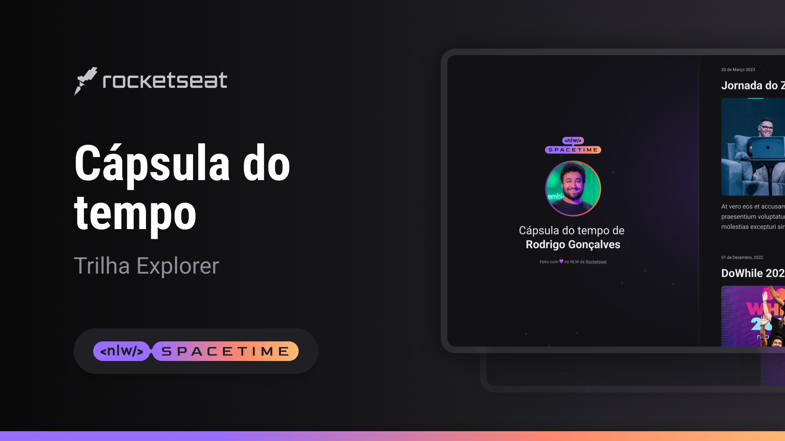

## 🖥️ Projeto
Esse é um projeto Web Responsivo de uma cápsula do tempo para exibir memórias em uma linha do tempo.

## 🚀 Tecnologias
Esse projeto foi desenvolvido durante o NLW da Rocketseat com as seguintes tecnologias:

-HTML
-CSS
-Git e GitHub

## 🏷️ Layout
Você pode visualizar o layout do projeto através 
[desse link](https://www.figma.com/file/YrGGLOf4Nu4w9jWx8wiKKm/Layout?type=design&node-id=0%3A1&t=4Ou66exZqZ6CTMJQ-1).
É necessário ter uma conta no [Figma](https://www.figma.com)